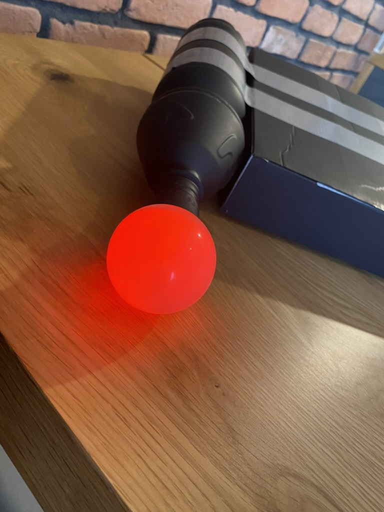
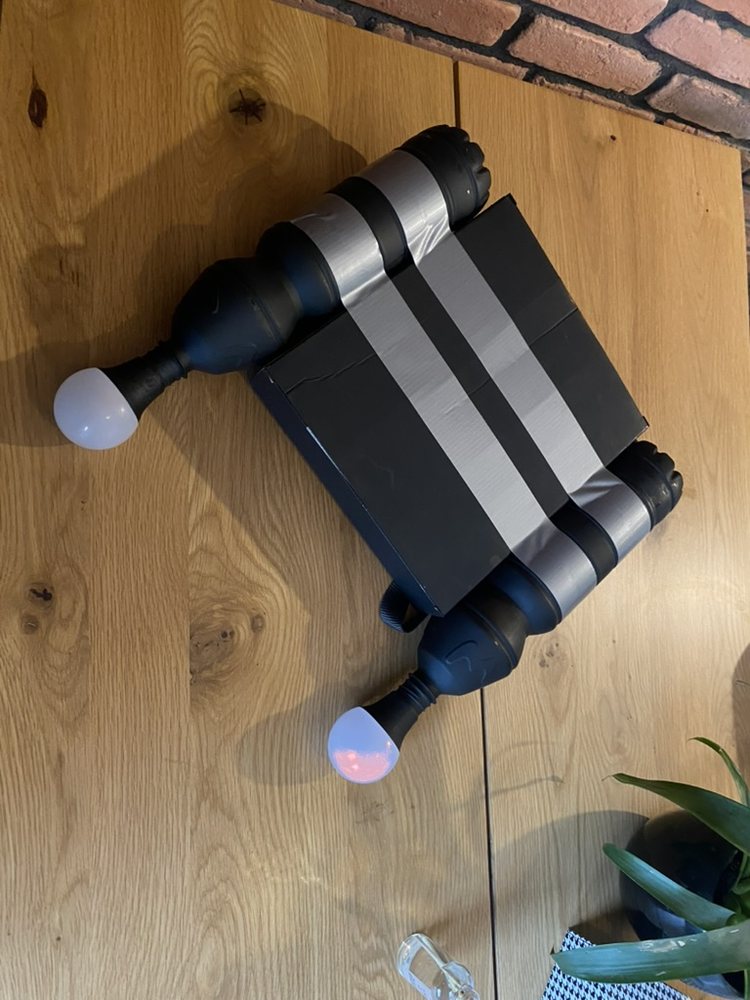
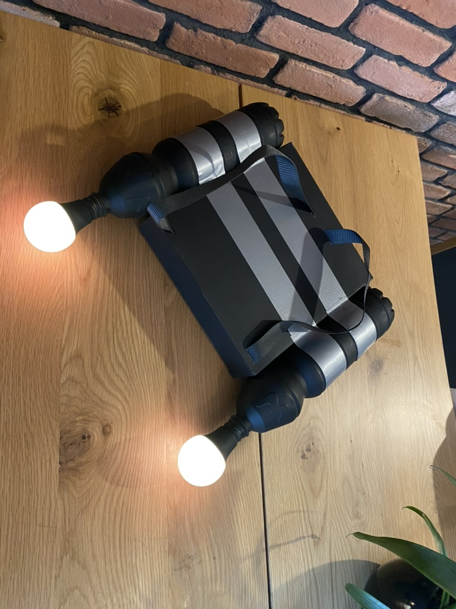

|  |  |  |
|---|---|---|

1.

// Definicje pinów
#define LED_PIN 20   // Pin do którego podłączone są LEDy
#define BUZZER_PIN 6 // Pin do którego podłączony jest buzzer
#define NUM_LEDS 16  // Liczba LEDów w pasku

2. 

// Definicje pinów
#define LED_PIN 8   // Pin do którego podłączone są LEDy
#define BUZZER_PIN 6 // Pin do którego podłączony jest buzzer
#define NUM_LEDS 16  // Liczba LEDów w pasku

